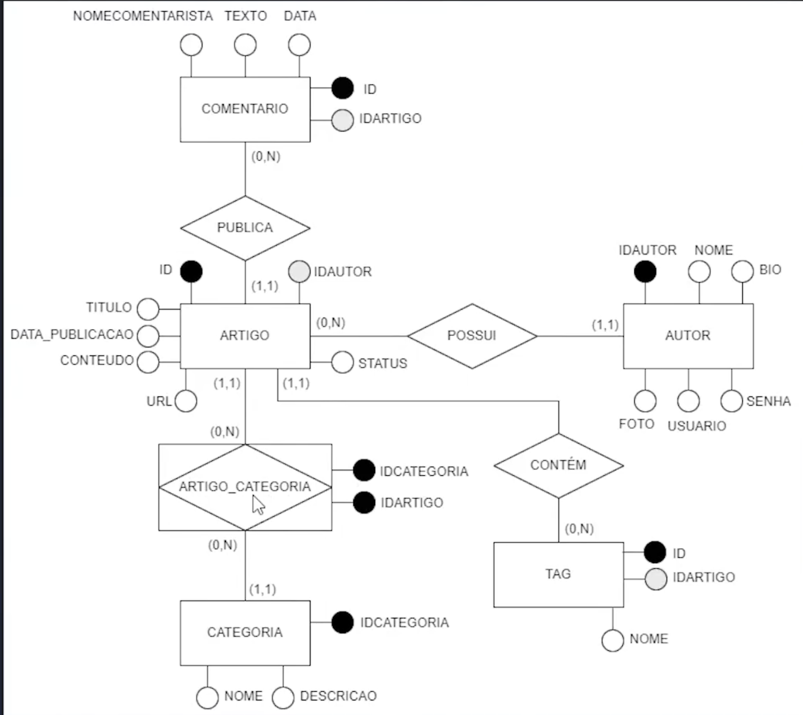

# NoSql - Blog
This is a project to practice **NoSQL** using:

* Spring Boot 3.1.4
* Spring Starter **MongoDB**
* Java 17
* Lombok
* [MongoDB CLI](https://github.com/igorgrv/NotesInGeneral/blob/master/NoSQL/README.md#instalando-cli)


About NoSQL:

* [NoSQL Personal Notes](https://github.com/igorgrv/NotesInGeneral/blob/master/NoSQL/README.md#comandos)

## Database relationship



## SQL comparison

To build a page like the one below, we would have at least **3 queries using SQL!**


```sql
SELECT artigos.*, autor.name FROM artigos
INNER JOIN autor ON autor.autor_id = artigos.audtor_id
WHERE artigo_url = 'xyz';

SELECT categoria.*, autor.name FROM categoria
INNER JOIN artigo_categoria ON artigo_categoria.idCategoria = categoria.id
WHERE artigo_categoria.id = 'xyz';

SELECT comentario.* FROM comentario
WHERE comentario.artigo_id = 'xyz';
```


With **NoSQL, we can and we MUST duplicate the data into a single document**

* Because NoSql is very performatic, the best use of it is to put everything that a **screen needs in a single document!**

  * **WARNING:** When you update the Author's name, for example, you'll need to update all the documents in other collections that have that Author's name!

Here's an example with NoSql:

```json
{
    _id: ObjectId("64a495d6896e49abd95879e8"),
    title: 'Title do artigo',
    categoria: "Categoria x", 
    author: {
      "_id": ObjectId("123")
       "name": "Igor Romero",
       "email": "igorgrv@hotmail.com"
 		},
    comentarios: [
      {
	      "_id": ObjectId("123"),
        "body":"meu comentario"
      }
    ]
}
```


